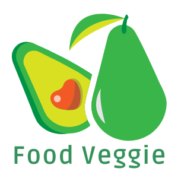

<h1 align="center">
  <br>
  <a href="https://github.com/camila-pereyra/food-veggie-pereyra-react/"></a>
  <br>
  FOOD VEGGIE
  <br>
</h1>
<h3 align="center">REACT JS E-COMMERCE PROYECTO FINAL DE <a href="https://www.coderhouse.com" target="_blank">CODERHOUSE</a>.</h3>
<p align="center"><a href="https://github.com/camila-pereyra/food-veggie-pereyra-react"><strong>Ver Documentación »</strong></a> </p>
  <br>
<p align="center">
  <a href="#acerca-del-proyecto">Acerca del proyecto</a> •
  <a href="#construido-con">Construido con</a> •
  <a href="#como-usarlo">Como usarlo</a> •
  <a href="#sitio-web">Sitio Web</a> •
  <a href="#mas-herramientas-usadas">Mas herramientas usadas</a> •
  <a href="#contacto">Contacto</a> 
</p>
  <br>

## Construido con
<p dir="auto"><a target="_blank" rel="noopener noreferrer nofollow" href="https://camo.githubusercontent.com/aeddc848275a1ffce386dc81c04541654ca07b2c43bbb8ad251085c962672aea/68747470733a2f2f696d672e736869656c64732e696f2f62616467652f6a6176617363726970742d2532333332333333302e7376673f7374796c653d666f722d7468652d6261646765266c6f676f3d6a617661736372697074266c6f676f436f6c6f723d253233463744463145"></a>
<a target="_blank" rel="noopener noreferrer nofollow" href="https://camo.githubusercontent.com/ab4c3c731a174a63df861f7b118d6c8a6c52040a021a552628db877bd518fe84/68747470733a2f2f696d672e736869656c64732e696f2f62616467652f72656163742d2532333230323332612e7376673f7374796c653d666f722d7468652d6261646765266c6f676f3d7265616374266c6f676f436f6c6f723d253233363144414642"></a>
<a target="_blank" rel="noopener noreferrer nofollow" href="https://camo.githubusercontent.com/4f9d20f3a284d2f6634282f61f82a62e99ee9906537dc9859decfdc9efbb51ec/68747470733a2f2f696d672e736869656c64732e696f2f62616467652f52656163745f526f757465722d4341343234353f7374796c653d666f722d7468652d6261646765266c6f676f3d72656163742d726f75746572266c6f676f436f6c6f723d7768697465"></a>
<a target="_blank" rel="noopener noreferrer nofollow" href="https://camo.githubusercontent.com/b768ae6e4f89b74512e6de02a8367fd71465bc3d88ef1cf2f1622e2017c32bea/68747470733a2f2f696d672e736869656c64732e696f2f62616467652f626f6f7473747261702d2532333536334437432e7376673f7374796c653d666f722d7468652d6261646765266c6f676f3d626f6f747374726170266c6f676f436f6c6f723d7768697465"></a>
<a target="_blank" rel="noopener noreferrer nofollow" href="https://camo.githubusercontent.com/5b148e7e2d5fdb541ea3cae400ea95884b75202ebe9846d996a20971602a8f01/68747470733a2f2f696d672e736869656c64732e696f2f62616467652f46697265626173652d3033394245353f7374796c653d666f722d7468652d6261646765266c6f676f3d4669726562617365266c6f676f436f6c6f723d7768697465"></a>
<a target="_blank" rel="noopener noreferrer nofollow" href="https://camo.githubusercontent.com/e6b67b27998fca3bccf4c0ee479fc8f9de09d91f389cccfbe6cb1e29c10cfbd7/68747470733a2f2f696d672e736869656c64732e696f2f62616467652f637373332d2532333135373242362e7376673f7374796c653d666f722d7468652d6261646765266c6f676f3d63737333266c6f676f436f6c6f723d7768697465"></a>
<a target="_blank" rel="noopener noreferrer nofollow" href="https://camo.githubusercontent.com/49fbb99f92674cc6825349b154b65aaf4064aec465d61e8e1f9fb99da3d922a1/68747470733a2f2f696d672e736869656c64732e696f2f62616467652f68746d6c352d2532334533344632362e7376673f7374796c653d666f722d7468652d6261646765266c6f676f3d68746d6c35266c6f676f436f6c6f723d7768697465"></a></p>

<br>

## Acerca del proyecto
Este proyecto está desarrollado en ReactJS y es el final del curso de ReactJS dictado en [CoderHouse](https://www.coderhouse.com).
Está desarrollado con ReactJs y es un sitio web que representa un Ecommerce de comida vegetariana/vegana. Está conectado a la base de datos [Firebase](https://firebase.google.com/), por ende los productos son cargados desde allí y cuando un usuario finaliza la compra, se genera una orden de compra que llega a la base de datos y se actualiza el stock en la base de datos y en el sitio web. La idea es que el usuario pueda navegar por el sitio libremente por el sitio, ver el detalle del producto deseado y agregarlo al carrito de compras. A su vez, si es que lo desea, puede filtrar por categorías y se mostrarán sólo los productos de la categoría seleccionada. Una vez agregados, puede ir al carrito, eliminar items, vaciarlo o bien generar la orden y finalizar la compra.

<br>
<a href="https://github.com/camila-pereyra/food-veggie-pereyra-react/"></a>
<br>

## Como usarlo
Para clonar y ejecutar esta aplicación, necesitará [Git](https://git-scm.com) y[Node.js](https://nodejs.org/en/download/) (que viene con [npm](http://npmjs.com)) instalados en su computadora. Desde su línea de comando:

```bash
# Clone this repository
$ git clone https://github.com/camila-pereyra/food-veggie-pereyra-react.git

# Go into the repository
$ cd veggie-food-pereyra

# Install dependencies
$ npm install

# Run the app
$ npm start
```
<br>

## Sitio web
[Ver sitio web](https://food-veggie-pereyra-react.vercel.app/)

<br>

## Mas herramientas usadas
- [SweetAlert2](https://sweetalert2.github.io/)
- [Vercel](https://vercel.com/dashboard)
- [Boostrap Icons](https://icons.getbootstrap.com/)

## Contacto
##### **camilabpereyra2305@gmail.com**
##### Linkedin: https://www.linkedin.com/in/camila-bianca-pereyra/
##### Github: https://github.com/camila-pereyra
##### Instagram: https://www.instagram.com/pereyracb/